# conva_fb ✈️📝🗼
conva_fb : Flight Booker # Conversational Agent Flow 

## Objective
-  Build a complete Conversational Agent Flow
-  Define intents, structure flows & pages, use entities & parameters for data extraction
-  Define conditions, fulfillment responses, & thoroughly test the agent

## Flight Booker Conversational Agent Flow 

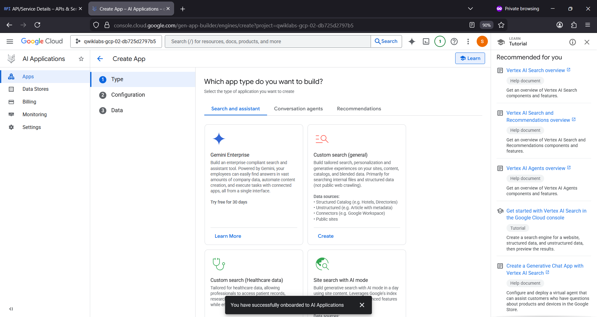

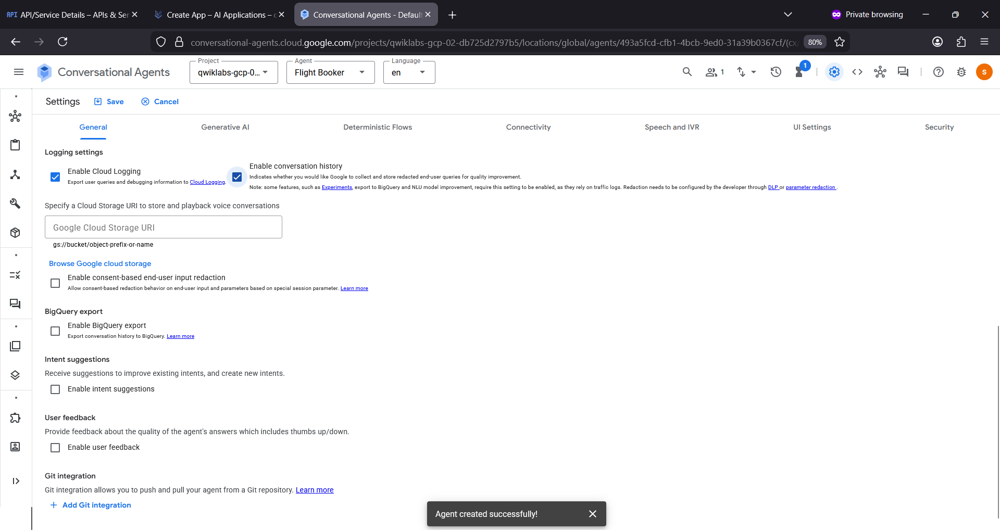

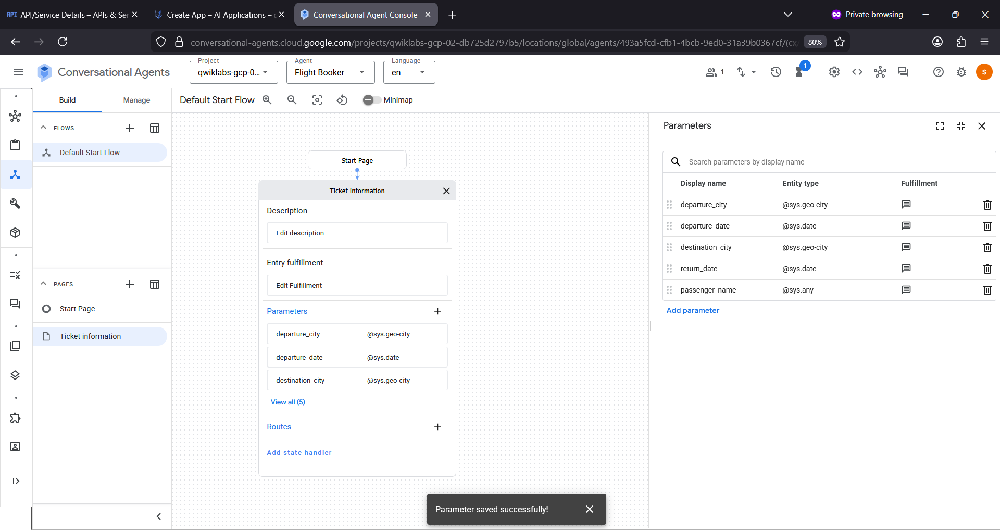

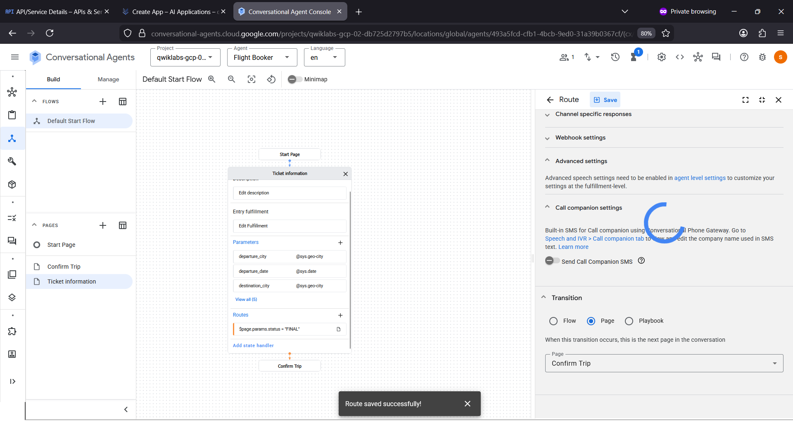

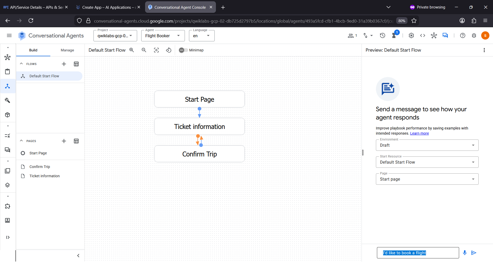

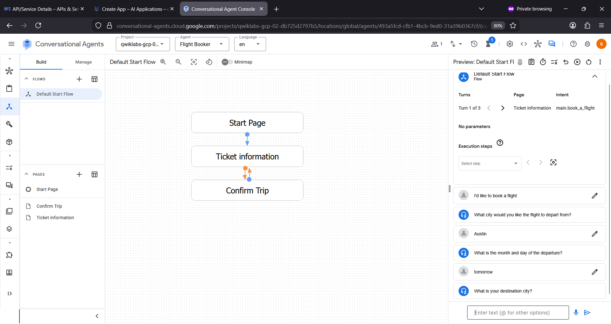

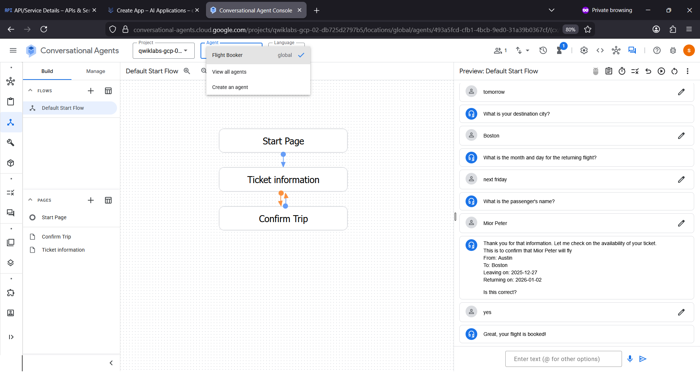

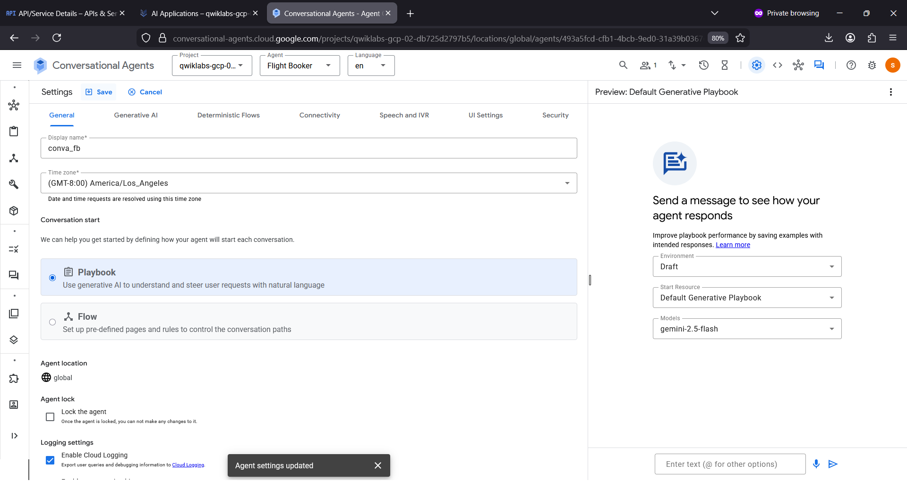

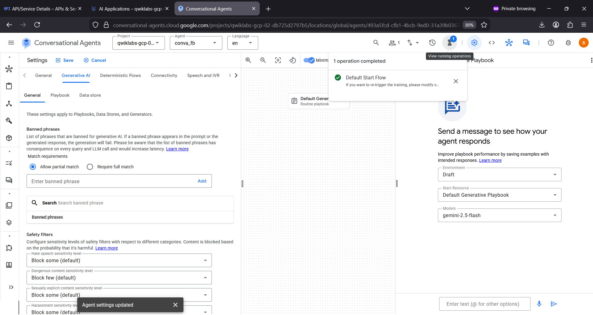

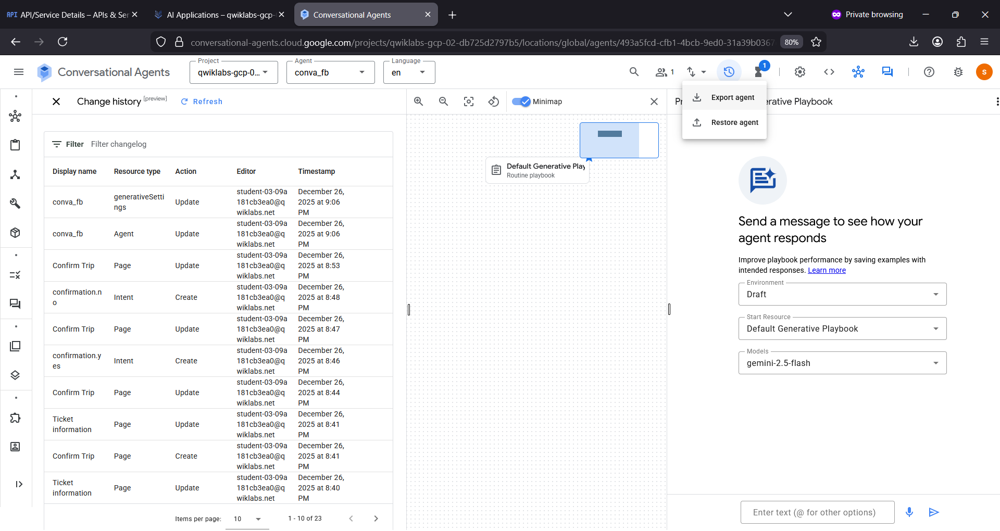

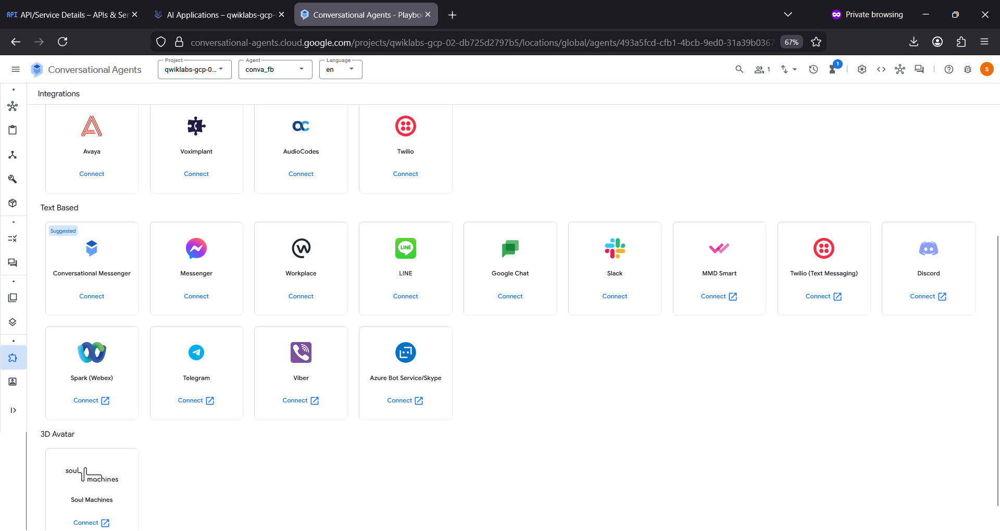

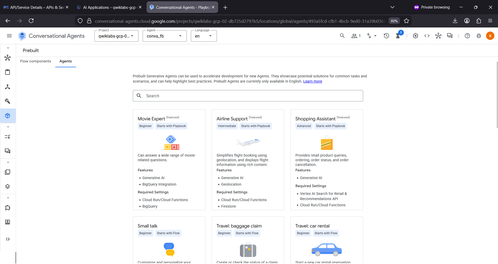

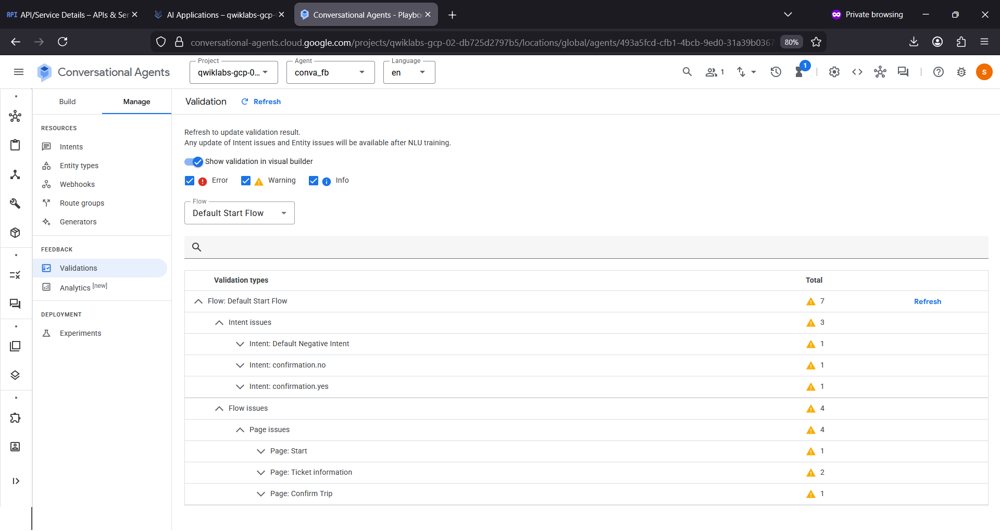

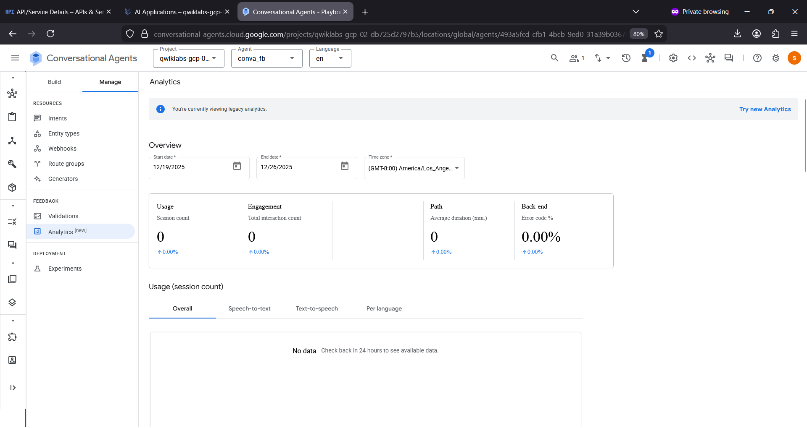

